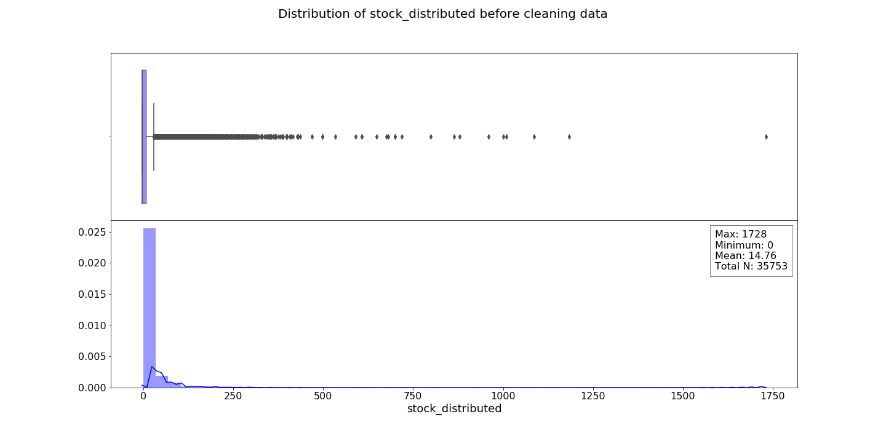
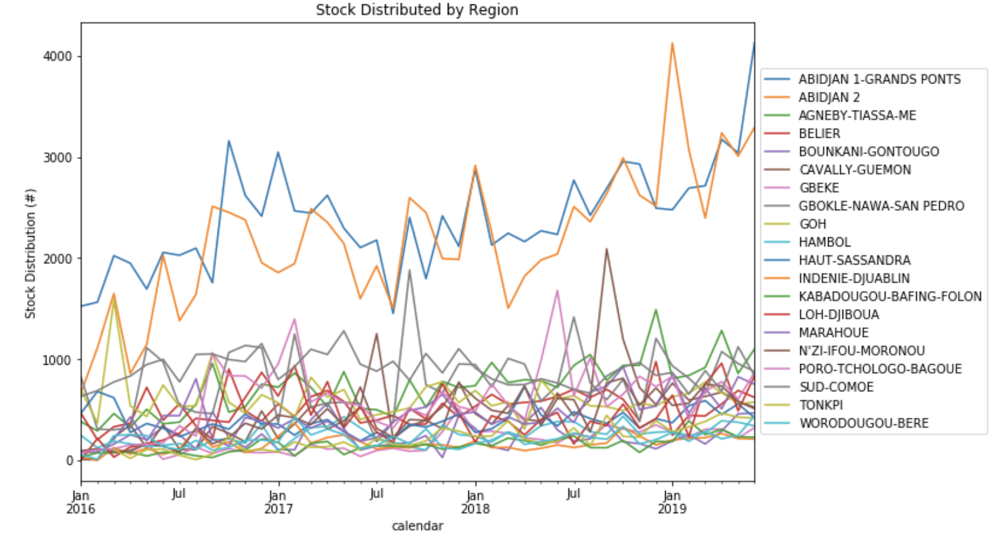
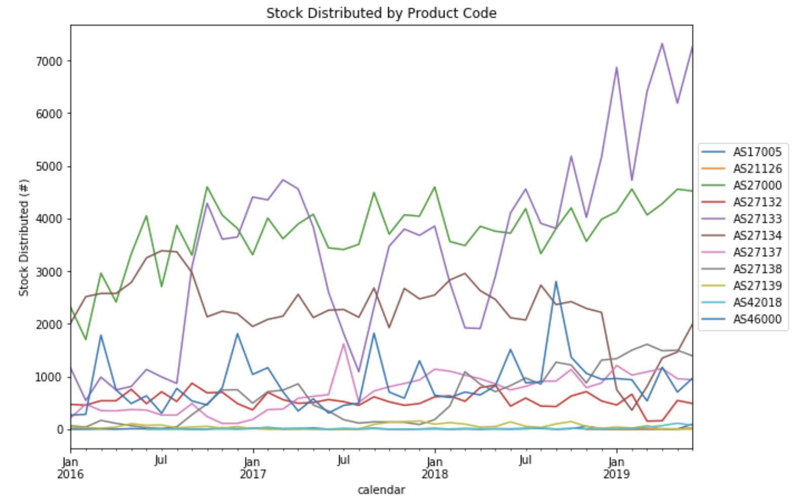
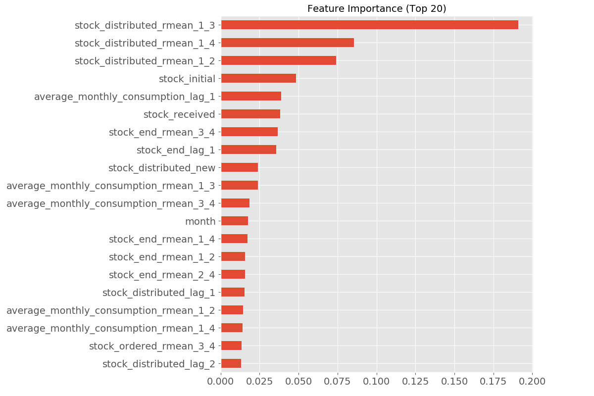

# Benshi.ai Modeling Exercise
### Rosie M Martinez, ScD, MPH

## Table of Contents:
* [Main Study Question](#Main-Study-Question)
* [Motivation and Background](#Motivation-and-Background)
* [The Data](#The-Data)
* [Analysis Flow Overview](#Analysis-Flow-Overview)
* [Exploratory Data Analysis (EDA)](#Exploratory-Data-Analysis)
* [Uni-variable Models Attempted](#Uni-variable-Models-Attempted)
    * [SARIMA](#SARIMA)
    * [Holt-Winters](#Holt-Winters)
    * [FB Prophet](#FB-Prophet)
* [Verification Metrics](#Verification-Metrics)
    * [All Data Aggregated by Date](#All-Data-Aggregated-by-Date)
    * [Individual Site-Product Metrics](#Individual-Site-Product-Metrics)
* [Forecast Distance Model](#Forecast-Distance-Model)
* [Final Submission Link](#final-submission)
* [Conclusions](#Conclusions)
* [Future Work](#Future-Work)

## Main Study Question:

Given contraceptive consumption data from the public sector health system in Côte D'Ivore (Ivory Coast), can I forecast consumption made monthly over the subsequent three months, July 2019, August, 2019, and September 2019.

## Motivation and Background:

Understanding the public health sector, especially in low- and middle-income countries, can help provide vital information to governments and communities where the need is greatest. The use and access to contraceptives enables individuals and couples to take control over their own ability to have children. Additionally, access to fertility care helps enable communities, families, and individuals better healthcare outcomes. 

Most of these low- and middle-income countries have been relying on outdated inventory systems, impacting communities when stock is too low or stock is too high and expires. Reliable availability of health commodities is fundamental to diagnosing and treating illness in primary healthcare settings. Trying to use, up-to-date machine learning (ML) methods can help alleviate the burdens that these outdated methods can have on the healthcare delivery systems [Agarwal, et al](https://www.ncbi.nlm.nih.gov/pmc/articles/PMC6491065/). 

The goal of this study is to determine whether or not ML forecasting can provide more accurate inventories, predicting where stock will be needed based on historical data. This will lead to more efficient healthcare delivery, allowing the healthcare professionals in these areas to focus on treating and saving lives, rather than worrying about what their site may need.

## The Data

This data came in multiple `.csv` files, including:
* `Train.csv`- captures contraceptive inventory and distribution at the health service delivery site level. This data spans from **January 2016 - June 2019** It includes features such as:
    * `stock_distributed` - the outcome of interest here
    * `product_code` - the contraceptive product ID
    * `site_code` - the public health service delivery site ID
    * Other stock variables, including `initial_stock`, `stock_received`, `average_monthly_consumption`, and a few others
* `contraceptive_case_data_annual.csv` - captures data pertaining to contraceptive use aggregated annually at the site level for 2016, 2017, and 2018
* `contraceptive_case_data_monthly.csv` - captures data pertaining to contraceptive use aggregated monthly at the site level for Jan 2019 - Sept 2019
* `service_delivery_site_data.csv` - health service delivery site information
* `product.csv` - contraceptive product information

[Back to Top](#Table-of-Contents)

## Analysis Flow Overview:

1. Exploratory Data Analysis
2. Running Uni-variable Models
3. Picking Verification Metrics
4. Attempting a Higher Level Model
5. Model Selection & Forecast 

## Exploratory Data Analysis
Full Dataset's Stock Distributed histogram & Boxplot:

* I removed all data that had less than 6 months worth of information at the product-site level or if data existed but there was no information in 2019. These were removed because there wouldn't be enough data for predictions moving forward or there was no interest in this site-product combination in 2019, therefore the prediction would be 0. 

Data after removing these product-site combinations

As we can see here, there weren't many huge differences to the underlying distribution of the data, therefore I decided to perform the rest of the EDA and all the analyses on this subset data.

First I wanted to look aggregated over time if there were any overall trends

We can see here that we do see an upward trend as time continues, however, there doesn't seem any sort of periodicity or seasonal trends.

Overall, I wanted to see if there were any particular trend in the outcome variable first by region, as looking by site would have been too granular to examine. 

Here we can see two regions stick out to us more than the others, the Abidjan regions 1 and 2 make up for the vast majority of the stock distributed and we can see an upward progression over time, however, beyond this we can't really see much of a trend in any of the other sites except that they are lower.

I additionally wanted to look at the outcome by the product to see if there were any trends across the product code.

The data here are a little less clear as we see major spikes and then dips month over month for some products while others are declining and some are staying stagnant. 

Last in this first part, I wanted to see if there were any strong correlations between my outcome `stock_distributed` and any of the other stock like variables found in the primary dataset.

Overall the trends seem minimal for the most part, there doesn't seem like much of a linear trend across any of the variables, with the *possible* exception of the Average Monthly Consumption, but that still had a lot of `0` values to make it look more fan like rather than linear.

## Uni-variable Models Attempted
**Note: All graphs shown here are examining the data at a YYYY/MM level, collapsing product ID and site ID into an aggregated sum. Model selection was based on the individual product x site level, however data was too granular to show all that in this summary. see [this `.py` file]() for more information** 

[Back to Top](#Table-of-Contents)

### SARIMA:
I chose to use the basic SARIMA because it extends the basic ARIMA model with an addition of a seasonal component. In order to identify my hyperparameters, I ran a grid search for each model, trying to identify the lowest AIC across all possibilities. 

When examining just the overall trends aggregated by date, it seems like this model did pretty well (see [Verification Metrics](#verification-metrics))

[Back to Top](#Table-of-Contents)

### Holt-Winters:
I wanted to try out the Holt-Winters forecasting also because this can apply three different smoothing functions to the model. This is another model that is used for forecasting seasonality, especially some sort of repeating period over time. Unfortunately this model did not perform well with my data, because the periodicity piece in my data didn't really exist and therefore couldn't predict a well. For this model also the hyperparameter that denoted the window, I had to keep it smaller because not all site-product data had the same 42 rows that the aggregated amount has, therefore it didn't predict as well.

[Back to Top](#Table-of-Contents)

### FB Prophet:
In addition to the first two more basic models, I wanted to try something a bit more complex that was built specifically for forecasting. The [Facebook Prophet](Prophet) model is specifically designed for analyzing time series that display patterns on different time scales. Since my data I have is by month/year, without any more granularity, it was of interest to me to identify if I had more than just a seasonal trend in my data. 

[Back to Top](#Table-of-Contents)

## Verification Metrics:

In this study I used three different metrics:

* RMSE (Root mean square error): This takes average of the error-squared it and then takes the square root over the overall average. One plus of the RMSE is that it puts itself back on the units of the outcome. It also gives more weight to bigger errors and cancels out potential negative/positive issues.
* MAE (Mean absolute error): This sums the error in absolute value, so we don't deal with negative values. It is relatively easy to explain, however it is scale dependent, meaning it will change on what we are forecasting.
* MASE (Mean absolute scaled error): Similar to the MAE, however it compare the model error to the naive model. If the value is above 1, it means the model performs worse than the naive model.

**Note: While I do look at three different metrics, I chose to focus on MASE because it seem more intuitive and interpretable in the context of time series**

### All Data Aggregated by Date:
**Note all metrics are based on the test set performance**

| Forecast Model | RMSE | MAE  | MASE | 
|--------------- | ---- | ---  | ---- |
|SARIMA | 1313.57 | 1065.48 | 0.84|
|Holt-Winters | 3044.80 | 2916.85 | 2.30 |
|FB Prophet | 2894.60 | 2524.21  | 1.99 |

Based on this metrics table, across the board, the SARIMA performed the best for all the products and sites aggregated together. However, this is not the model of interest, but this is just an example of how the model would be chosen.

[Back to Top](#Table-of-Contents)

### Individual Site-Product Metrics:

**Note all metrics are based on the test set performance**
| Forecast Model | RMSE | MAE  | MASE | 
|--------------- | ---- | ---  | ---- |
|SARIMA | 28.5 | 10.74  | 1.06|
|Holt-Winters | 1.13E12| 1.20E10  | 1.29E7 |
|FB Prophet | 46.01 | 18.75 | 1.86 |

These are the aggregated metrics from the individual site/product models when examining across all models. For information about individual test metrics, see [the `.csv` here](results/all_metrics.csv). Based on these results, across all three metrics, it seems like the basic SARIMA model did the best across the board, therefore the univariate models will all be predicted using SARIMA.

[Back to Top](#Table-of-Contents)

## Forecast Distance Model
For this model I create lag and rolling average windows with lags for the numeric variables in the `train.csv`. For my categorical variables, I chose to ordinally encode the variables. I created the prediction set also and added that on to the data before spliting the data.

In order to preserve the validity of my test, I then split my data into four different datasets:

1. **Prediction Set**: The dataset which I need to predict on **July 2019 - September 2019** 
2. **Holdout Set**: Any data in the months of **April 2019 - June 2019**, left this to hold for the end
3. **Training Set**: Any data contained in the months **Jan 2016 - December 2018**
4. **Test Set**: Any data contained in the months **Jan 2019 - March 2019**

I chose not to do a K-fold CV or even a TimeSeriesSplit, because even with several tens of thousands of rows of data, when I looked at how granular these predictions had to be it really came down to about 42 data points per site-product grouping, which isn't actually a lot of data. Therefore I chose to do a single CV, with the majority of the data in the training set and a test set, which is how I would chose a model. Then check on the validation set and then predict on the completely unseen data that I don't have.

I chose to model my data using the forecast distance schema, where I would try to use the model to predict one month out, two months out, and three months out (based on the time window I am looking at).

The different models I chose to attempt were:

* Linear Regression
* **Random Forest**
* Light Gradient Boosting
* Cat Boosting
* Ada Boosting

For each of these models, I basically took the default hyperparameters to start with.

The metrics are the same as in the [Metrics](#verification-metrics) section. The final model was chosen based on this metric matrix below:

| Forecast Model | RMSE | MAE  | MASE | 
|--------------- | ---- | ---  | ---- |
|Linear Regression | 24.6 | 11.8  | 0.0038|
|**Random Forest** | 21.7 | 9.4  | 0.0030 |
|Light GBM | 24.4 | 10.9 | 0.0035 |
|Cat Boost | 22.4 | 9.7 | 0.00031 |
|Ada Boost | 38.3 | 32.2 | 0.0103 |

Based on this, the Random Forest model performed the best across the uni-variable and forecast distance tests. When performing the Random Forest model on the Holdout Set (data the model hasn't seen before), the metrics were still good, worse than the training, but that is to be expected as we want a more generalizable model.

| Random Forest Model | RMSE | MAE  | MASE | 
|--------------- | ---- | ---  | ---- |
| Training Set | 21.7 | 9.4  | 0.0030 |
| Validation Set | 21.7 | 10.2 | 0.0033 |

Additionally, I wanted to look and see what the feature importance was for the features I have in my model.

[Back to Top](#Table-of-Contents)

## Conclusions

Using a uni-variable model, I was able to predict the next three months stock distributed based on the historical data at the granularity of site and product. While this model worked and gave predictions with the best error metric among the uni-variable models, it was outperformed by the higher level ensemble methods.

I tried some ensemble methods as I believe that adding in more than just the outcome into the model could help us gain a better understanding of what is going on with this data and how to best serve these communities that need these healthcare supplies. Additionally, adding in lag variables allows us to gain more information about future predictions when we have no information. While I did not go with a deep learning method (LSTM or DeepAR), I felt that the random forest and gradient boosting models added enough complexity to gain a few more insights from the primary dataset. 

## [Final Submission](results/submission_predictions.csv)

[Back to Top](#Table-of-Contents)

## Future Work
With any model, several assumptions are made, which could be seen as weaknesses or areas of improvement for the analyses. I have have made several assumptions for my analyses including: 

* For the uni-variable models, I didn't perform a formal cross validation, with a sliding window for the train/test set. There are a few reasons for this, but the main reason is that the data is too granular, meaning that some of the site/product combinations had very few samples in it to perform a formal CV. Instead, I took an approach with doing a single train test split, 80/20, so that I would have some test data to compare my verification metrics. If I were to do this study again, I would want to use a formal CV, however, with the methods I chose, I was limited by my sample size.

* Additionally for the ensemble methods, I was running a type of cross validation but not a K-fold cross validation, so these results are really only based on a single "go around". In the future, if there was more information in the data on the time scale, that would allow us to use more robust cross validation methods.

* This analysis focused on the primary dataset, while some secondary datasets were provided, the overlap between the column names and product codes were confusing and therefore, I decided to try to focus only on the primary dataset. In the future, I would like to understand more the relationship between the column names in the secondary datasets with the syntax of the product codes so that the data can be used and help bolster the current analysis.

* If I can try some of the deep learning methods to improve the metrics, that would be ideal, however the downfall to that is the ability to interpret, so depending on what the client wants, that might be an option to try next.

[Back to Top](#Table-of-Contents)

