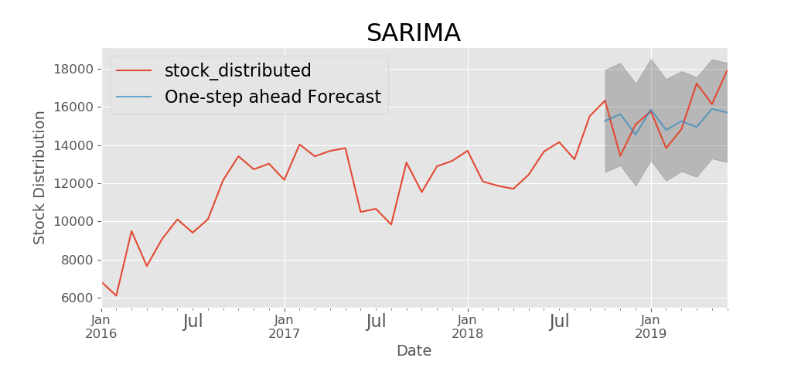
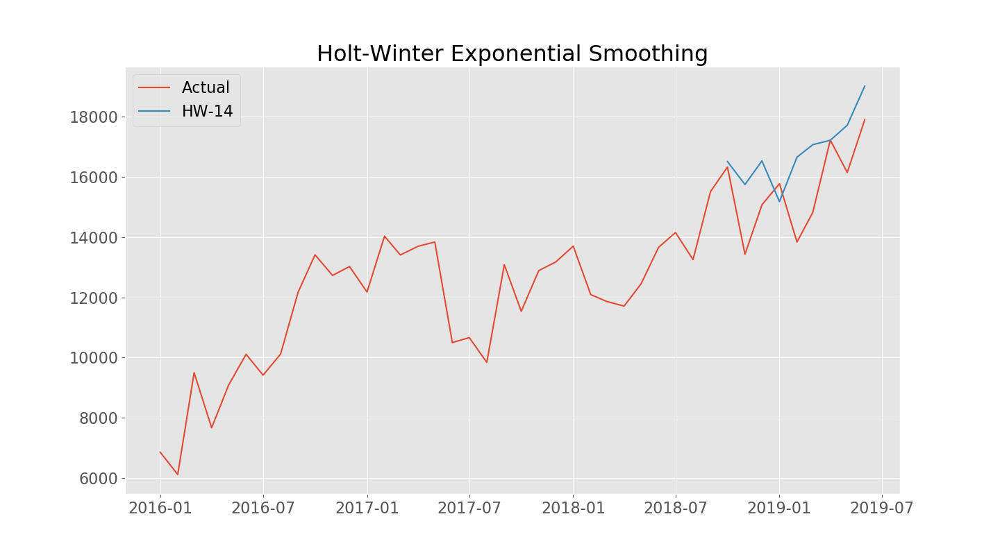
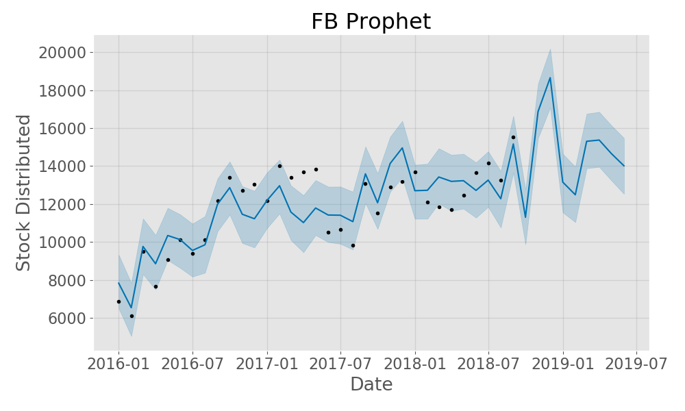

# Benshi.ai Modeling Exercise
### Rosie M Martinez, ScD, MPH

## Table of Contents:
* [Main Study Question](#Main-Study-Question)
* [Motivation and Background](#Motivation-and-Background)
* [The Data](#The-Data)
* [Analysis Flow Overview](#Analysis-Flow-Overview)
* [Exploratory Data Analysis (EDA)](#Exploratory-Data-Analysis-(EDA))
* [Uni-variable Models Attempted](#Uni-variable-Models-Attempted)
    * [SARIMA](#SARIMA)
    * [Holt-Winters](#Holt-Winters)
    * [FB Prophet](#FB-Prophet)
* [Verification Metrics](#Verification-Metrics)
    * [All Data Aggregated by Date](#All–Data–Aggregated–by-Date)
    * [Individual Site/Product Models](#Individual-Site/Product-Models)
* [Higher Level Models Attempted](#Higher-Level-Models-Attempted)
    * [Random Forest Model](#Random-Forest-Model)
    * [LightGBM (gradient boosting)](#LightGBM-(gradient-boosting))
    * [Hierarchical Time Series](#Hierarchical-Time-Series)
* [Conclusions](#Conclusions)
* [Future Work](#Future-Work)

## Main Study Question:

Given contraceptive consumption data from the public sector health system in Côte D'Ivore (Ivory Coast), can I forecast consumption made monthly over the subsequent three months, July 2019, August, 2019, and September 2019.

## Motivation and Background:

Understanding the public health sector, especially in low- and middle-income countries, can help provide vital information to governments and communities where the need is greatest. The use and access to contraceptives enables individuals and couples to take control over their own ability to have children. Additionally, access to fertility care helps enable communities, families, and individuals better healthcare outcomes. 

Most of these low- and middle-income countries have been relying on outdated inventory systems, impacting communities when stock is too low or stock is too high and expires. Reliable availability of health commodities is fundamental to diagnosing and treating illness in primary healthcare settings. Trying to use, up-to-date machine learning (ML) methods can help alleviate the burdens that these outdated methods can have on the healthcare delivery systems [Agarwal, et al](https://www.ncbi.nlm.nih.gov/pmc/articles/PMC6491065/). 

The goal of this study is to determine whether or not ML forecasting can provide more accurate inventories, predicting where stock will be needed based on historical data. This will lead to more efficient healthcare delivery, allowing the healthcare professionals in these areas to focus on treating and saving lives, rather than worrying about what their site may need.

## The Data

This data came in multiple `.csv` files, including:
* `Train.csv`- captures contraceptive inventory and distribution at the health service delivery site level. This data spans from **January 2016 - June 2019** It includes features such as:
    * `stock_distributed` - the outcome of interest here
    * `product_code` - the contraceptive product ID
    * `site_code` - the public health service delivery site ID
    * Other stock variables, including `initial_stock`, `stock_received`, `average_monthly_consumption`, and a few others
* `contraceptive_case_data_annual.csv` - captures data pertaining to contraceptive use aggregated annually at the site level for 2016, 2017, and 2018
* `contraceptive_case_data_monthly.csv` - captures data pertaining to contraceptive use aggregated monthly at the site level for Jan 2019 - Sept 2019
* `service_delivery_site_data.csv` - health service delivery site information
* `product.csv` - contraceptive product information

[Back to Top](#Table-of-Contents)

## Analysis Flow Overview:

1. Exploratory Data Analysis
2. Running Uni-variable Models
3. Picking Verification Metrics
4. Attempting a Higher Level Model
5. Model Selection & Forecast 

## Exploratory Data Analysis (EDA)

## Uni-variable Models Attempted
** Note: All graphs shown here are examining the data at a YYYY/MM level, collapsing product ID and site ID into an aggregated sum. Model selection was based on the individual product x site level, however data was too granular to show all that in this summary. see [this `.py` file]() for more information ** 

[Back to Top](#Table-of-Contents)

### SARIMA:
I chose to use the basic SARIMA because it extends the basic ARIMA model with an addition of a seasonal component. In order to identify my hyperparameters, I ran a grid search for each model, trying to identify the lowest AIC across all possibilities. 

When examining just the overall trends aggregated by date, it seems like this model did pretty well (see [Verification Metrics](#verification-metrics))

[Back to Top](#Table-of-Contents)

### Holt-Winters:
I wanted to try out the Holt-Winters forecasting also 

[Back to Top](#Table-of-Contents)

### FB Prophet:
In addition to the first two more basic models, I wanted to try something a bit more complex that was built specifically for forecasting. The [Facebook Prophet](Prophet) model is specifically designed for analyzing time series that display patterns on different time scales. Since my data I have is by month/year, without any more granularity, it was of interest to me to identify if I had more than just a seasonal trend in my data. 

[Back to Top](#Table-of-Contents)

## Verification Metrics:

In this study I used three different metrics:

* RMSE (Root mean square error): This takes average of the error-squared it and then takes the square root over the overall average. One plus of the RMSE is that it puts itself back on the units of the outcome. It also gives more weight to bigger errors and cancels out potential negative/positive issues.
* MAE (Mean absolute error): This sums the error in absolute value, so we don't deal with negative values. It is relatively easy to explain, however it is scale dependent, meaning it will change on what we are forecasting.
* MASE (Mean absolute scaled error): Similar to the MAE, however it compare the model error to the naive model. If the value is above 1, it means the model performs worse than the naive model.

** Note: While I do look at three different metrics, I chose to focus on MASE because it seem more intuitive and interpretable in the context of time series **

### All Data Aggregated by Date:
** Note all metrics are based on the test set performance **

| Forecast Model | RMSE | MAE  | MASE | 
|--------------- | ---- | ---  | ---- |
|SARIMA | 1390.53 | 1108.15 | 0.97|
|Holt-Winters | 1653.68 | 1368.48 | 1.19 |
|FB Prophet | 2973.96 | 2636.40  | 2.30 |

Based on this metrics table, across the board, the SARIMA performed the best for all the products and sites aggregated together. However, this is not the model of interest, but this is just an example of how the model would be chosen.

### Individual Site/Product Models:

** Note all metrics are based on the test set performance **
| Forecast Model | RMSE | MAE  | MASE | 
|--------------- | ---- | ---  | ---- |
|SARIMA | 22.18 | 6.50  | 1.04|
|Holt-Winters | 3007.98 | 51.69  | 8.30 |
|FB Prophet | 35.74 | 11.40 | 1.83 |

These are the metrics from the individual site/product models when examining across all models. For information about individual test metrics, see [the `.csv` here](). Based on these results, across all three metrics, it seems like the basic SARIMA model did the best across the board, therefore the univariate models will all be predicted using SARIMA.

[Back to Top](#Table-of-Contents)

## Higher Level Models Attempted

### Random Forest Model:

[Back to Top](#Table-of-Contents)

### LightGBM (gradient boosting):

[Back to Top](#Table-of-Contents)

### Hierarchical Time Series:

[Back to Top](#Table-of-Contents)

## Conclusions

Using a univariate model, I was able to predict the next three months stock distributed based on the historical data at the granularity of site and product. While this model worked and gave predictions with the best error metric when in the validation stage, it is still a univariate model and may not be picking up on the nuances that the other features could provide. [Link to the Univariate Solutions]()

Additionally, I tried some ensemble methods as I believe that adding in more than just the outcome into the model could help us gain a better understanding of what is going on with this data and how to best serve these communities that need these healthcare supplies. While I did not go with a deep learning method (LSTM or DeepAR), I felt that the random forest and gradient boosting models added enough complexity to gain a few more insights from the primary dataset. [Link to the More Complex solutions]()

## Future Work

* The first weakness of this analyses, is that I didn't perform a formal cross validation, with a sliding window for the train/test set. There are a few reasons for this, but the main reason is that the data is too granular, meaning that some of the site/product combinations had very few samples in it to perform a formal CV. Instead, I took an approach with doing a single train test split, 80/20, so that I would have some test data to compare my verification metrics. If I were to do this study again, I would want to use a formal CV, however, with the methods I chose, I was limited by my sample size.

* This analysis focused on the primary dataset, while some secondary datasets were provided, the overlap between the column names and product codes were confusing and therefore, I decided to try to focus only on the primary dataset. In the future, I would like to understand more the relationship between the column names in the secondary datasets with the syntax of the product codes so that the data can be used and help bolster the current analysis.

[Back to Top](#Table-of-Contents)

